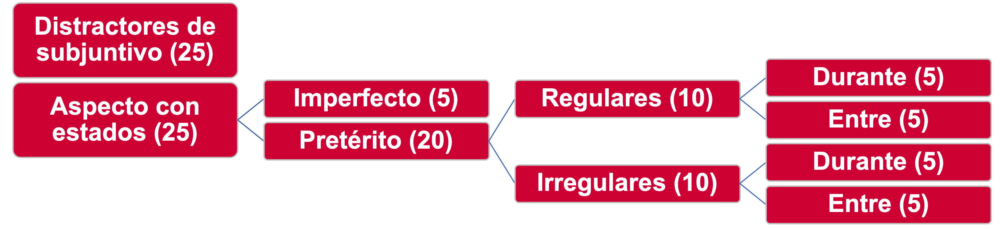
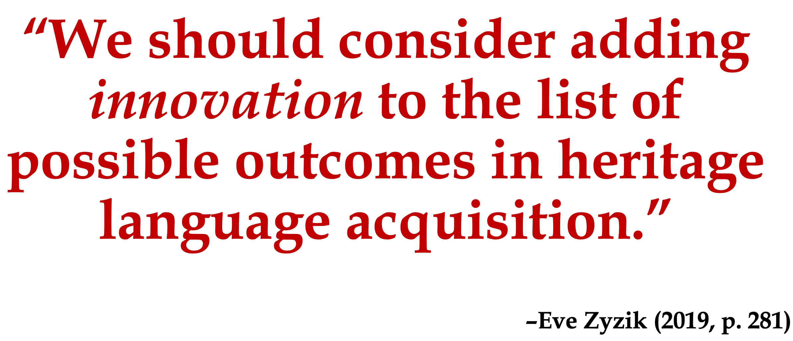

```{css, echo = FALSE}
.huge-code {font-size: 200% !important}
.tiny-code {font-size: 50% !important}
```

```{r setup, echo = FALSE, include = FALSE, warning = FALSE}
knitr::opts_chunk$set(echo = FALSE, message = FALSE, warning = FALSE)
options(scipen = 999)

library(tidyverse)
library(base)
library(lme4)
library(knitr)
library(kableExtra)
library(ds4ling)
library(xaringan)
library(patchwork)
library(jtools)
library(sjPlot)
library(sjlabelled)
library(sjmisc)
```

```{r, load-files}
Heritage_Preterit_EPT <- read_csv("../CSV Files/Heritage/Heritage EPT Preterit Data.csv")
Heritage_Preterit_FCT <- read_csv("../CSV Files/Heritage/Heritage FCT Preterit Data.csv")
Comparison_Preterit_EPT <- read.csv("../CSV Files/Comparison/Comparison EPT Preterit Data.csv")
Comparison_Preterit_FCT <- read.csv("../CSV Files/Comparison/Comparison FCT Preterit Data.csv")
```

```{r, preterit-data-bind}
Preterit_EPT <- rbind(Heritage_Preterit_EPT, Comparison_Preterit_EPT)
Preterit_FCT <- rbind(Heritage_Preterit_FCT, Comparison_Preterit_FCT)
Preterit_Aggregate <- rbind(Preterit_EPT, Preterit_FCT)

Heritage_EPT_Modified <- aggregate(Heritage_Preterit_EPT$ExpForm, list(Heritage_Preterit_EPT$Participant_ID), FUN = mean)
Heritage_EPT_Modified <- Heritage_EPT_Modified %>% rename(Part_Avg = x)
Heritage_EPT_Modified <- left_join(Heritage_Preterit_EPT, Heritage_EPT_Modified, by = c("Participant_ID" = "Group.1"))

Heritage_FCT_Modified <- aggregate(Heritage_Preterit_FCT$ExpForm, list(Heritage_Preterit_FCT$Participant_ID), FUN = mean)
Heritage_FCT_Modified <- Heritage_FCT_Modified %>% rename(Part_Avg = x)
Heritage_FCT_Modified <- left_join(Heritage_Preterit_FCT, Heritage_FCT_Modified, by = c("Participant_ID" = "Group.1"))

Preterit_EPT_Aggregate <- aggregate(Preterit_EPT$ExpForm, list(Preterit_EPT$Participant_ID), FUN = mean)
Preterit_EPT_Aggregate <- Preterit_EPT_Aggregate %>% rename(Part_Avg = x)
Preterit_EPT_Aggregate <- left_join(Preterit_EPT, Preterit_EPT_Aggregate, by = c("Participant_ID" = "Group.1"))

Preterit_FCT_Aggregate <- aggregate(Preterit_FCT$ExpForm, list(Preterit_FCT$Participant_ID), FUN = mean)
Preterit_FCT_Aggregate <- Preterit_FCT_Aggregate %>% rename(Part_Avg = x)
Preterit_FCT_Aggregate <- left_join(Preterit_FCT, Preterit_FCT_Aggregate, by = c("Participant_ID" = "Group.1"))

Heritage_Composite <- rbind(Heritage_Preterit_EPT, Heritage_Preterit_FCT)
```

# Aspecto morfológico

* El **.RUred[aspecto morfológico]** se refiere a *cómo* un evento avanza por un tiempo


--
* Los sufijos verbales del español codifican un **.RUred[contraste aspectual]** del tiempo pasado:
  + **.RUred[Pretérito:]** eventos *ligados* e *incoativos*
  + **.RUred[Imperfecto:]** eventos no *ligados* (hábitos, descripciones, acciones continuas)


--
* El inglés no tiene sufijos de aspecto (-ed)

---
# Aspecto léxico

- Lo que el significado implica sobre el movimiento por el tiempo (Vendler, 1967)


--
- Categorías **.RUred[télicas]**: *realizaciones* y *logros*; tienen puntos de terminación inherentes:
  + I listened to a song *.grey[(until the song ended).]*
  + I met Patrick *.grey[(at today's presentation).]*


--
- Categorías **.RUred[atélicas]**: *actividades* y *estados*; NO tienen puntos de terminación inherentes
  + I listened to music  *.grey[(until Tuesday)].*
  + I knew Patrick  *.grey[(at today's presentation)].*


---
# Hipótesis de aspecto léxico

- Andersen (1991): los bilingües conectan el aspecto léxico y el aspecto gramatical


--
- Se forman asociaciones entre la **.RUred[telicidad]** y la **.RUred[incoatividad]**


--
  + Realizaciones, logros: *ligados* e **incoativos**; se adquieren como prototipos del pretérito


--
  + Actividades, estados: *no ligados*; se adquieren como prototipos del imperfecto


--
- Apoyada a través de muchas lenguas y con aprendices y hablantes de herencia de español


--
- Los estados con morfología pretérita es la asociación más difícil de adquirir (e.g., Montrul, 2002, 2009)


---
# Teorías de las lenguas de herencia

--
- **.RUred[Adquisición incompleta]** (e.g., Montrul, 2002, 2009): la edad al empezar el desarrollo bilingüe restringe la adquisición de la lengua de herencia


--
  +  **.RUred[Producto]** de adquisición

--
  +  La edad al principio de adquirir 2°L restringe la exposición y el desarrollo


--
- **.RUred[Hipótesis de activación]** (Putnam & Sánchez, 2013; Perez-Cortes et al., 2019): los patrones de uso del lenguaje afectan las representaciones gramaticales

--
  + **.RUred[Proceso]** de adquisición

--
  + Cantidades de uso de la lengua de herencia afectan la *reestructuración* (Lardiere, 2008)


--
  + La producción afectada antes de la comprensión


--
  + La **.RUred[frecuencia léxica]** afecta el uso de la morfología flexiva


---
# Frecuencia léxica

- **.RUred[Frecuencia léxica]** (*token frequency*): la cantidad de veces que una forma parece en el estímulo que un hablante recibe


--
- Afecta a los hablantes de herencia del español en el uso de:

--
  + Subjuntivo (Giancaspro, 2020; Perez-Cortes, 2020)

--
  + Concordancia de género, sustantivos y adjetivos (Hur et al., 2020)

--
  + Marcado diferencial de objeto (*a personal*) (Hur, 2020)

--
  + Mandatos imperativos (López-Otero, 2020)

--
 + *.grey[Contraste aspectual pretérito-imperfecto]*

---
# Preguntas de investigación y hipótesis


1. **.RUred[¿Hay diferencias en el uso del pretérito con estados entre la producción y una tarea receptiva?]**

  +  Más uso del pretérito con estados en una tarea receptiva
  +  Asimetrías de producción y comprensión


--
2. **.RUred[¿Es posible que la regularidad morfológica y la frecuencia léxica afecten la producción del pretérito con estados?]**

  + Más probables de usar el pretérito con verbos de estado frecuentes
  + Más probables de usar el pretérito con verbos regulares


--
3. **.RUred[¿Hay una relación entre la frecuencia de uso del español y los efectos de la frecuencia léxica y la regularidad morfológica?]**

  + L_s hablantes que usan el español con menos frecuencia se verán más afectad_s por estos factores

--
4. **.RUred[¿Hay un efecto para la edad, la proficiencia, y/o la frecuencia de uso en el uso del pretérito con estados?]**

  + La frecuencia de uso afectará el uso del pretérito con estados
  + La edad al principio de adquisición del inglés no lo afectará


---
# El experimento

* 57 participantes

  +  45 hablantes de herencia (edad de principio de adquisición de inglés entre 0 y 8)
  +  12 bilingües dominantes en el español (primera llegada a los EE. UU. a partir de 12 años)


--
* Examen de proficiencia estrita (Montrul & Slabakova, 2003)


--
* Cuestionario biográfico (escala de uso de español y de palabras individuales)


--
* 2 tareas experimentales
  + Tarea de producción solicitada, 50 estímulos
  + Tarea de elección forzada, 50 estímulos


---
# Ítems verbales

- 10 verbos de estado de 2 sílabas controlados por frecuencia según el *Corpus del español* (Davies, 2006)
  + 5 verbos regulares
  + 5 verbos irregulares


--
```{r, load-verb-list}
States_List <- read.csv("../CSV Files/Lexical Item Analysis/List of State Verbs.csv")
```

**Verbos utilizados en las tareas experimentales con sus frecuencias léxicas**
```{r, verb-kable}
kable(States_List[1:4])
```

---
# Tareas experimentales

* **.RURed[Tarea de producción]**: completación oral de oraciones con el infinitivo proyectada en la pantalla

* **.RURed[Tarea receptiva]**: selección binaria del pretérito o imperfecto


--
```{r, task-structure-diagram}

```

---
# Ejemplos de estímulos (producción)

- Rodrigo empezó a estar afiebrado el viernes por la noche.  No le bajó la temperatura hasta el domingo.  No se enfermaba mucho de niño.  Describe la fiebre de Rodrigo. .RUred[Durante 2 días…**(tener)**]


--

- Daniel llegó a Paris en 2015.  Se fue en 2019.  Le gustaba mucho vivir allí.  Describe su tiempo en París.  .RUred[Durante 4 años…**(vivir)**]


---
# Modelos estadísticos

- Uso de variables continuas

--

- **.RUred[Modelos estadísticos:]** Modelos Lineales Generalizados Mixtos con uso del pretérito (omnibus, tarea de producción, tarea receptiva) y los predictores:


--
  + Frecuencia léxica en Davies (2006)
  

--
  + Regularidad morfológica (binaria)


--
  + Autoevaluación de frecuencia de uso del español

  
--
  + Edad al principio de adquisición de inglés


--
  + Interacciones entre frecuencia léxica, regularidad morfológica, y frecuencia de uso

---
# Resultados agregados "omnibus"
```{r, generate-omnibus-model}
Aspect_Omnibus = glmer(
  ExpForm ~ Tarea + Token_Main_Std * Reg_Main * FofA_Std + AoA_ENG_Std +
    (1 + Token_Main_Std | Group_No) + (1 + FofA_Std | Item),
  data = Heritage_Composite, family = "binomial",
  control = glmerControl(optimizer = "bobyqa", optCtrl = list(maxfun=3e5)))
```

```{r, plot-omnibus-model}
Omnibus_Plot <- plot_model(Aspect_Omnibus, show.values = TRUE, value.offset = .3, transform = NULL, vline.color = "black") +
  scale_x_discrete(labels = c("Frecuencia : regularidad : uso", "Regularidad : uso", "Frecuencia : uso", "Frecuencia : regularidad", "Edad de adquisición", "Frecuencia de uso", "Regularidad morfológica", "Frecuencia léxica", "Tarea")) + 
  scale_y_continuous(breaks = seq (-2.5, 2.5, 2.5),
                     limits = c(-2.5, 2.5)) +
  labs(title = "Modelo agregado “omnibus”", y = "Estimaciones β") +
  theme(axis.text = element_text(size = 16),
        axis.title = element_text(size = 18, face = "bold"),
        plot.title = element_text(hjust = 0.5, size = 24, face = "bold"))
```

```{r, show-omnibus-plot, height = 10, fig.width = 16, fig.align = 'center', fig.retina = 2}
(Omnibus_Plot)
```

---
# Resultados de producción
```{r, generate-EPT-model}
Aspect_Production = glmer(
  ExpForm ~ Token_Main_Std * Reg_Main * FofA_Std + AoA_ENG_Std +
    (1 + Token_Main_Std | Group_No) + (1 + FofA_Std | Item),
  data = Heritage_Preterit_EPT, family = "binomial",
  control = glmerControl(optimizer = "bobyqa", optCtrl = list(maxfun=3e5)))
```

```{r, plot-EPT-model}
EPT_Plot <- plot_model(Aspect_Production, show.values = TRUE, value.offset = .3, transform = NULL, vline.color = "black") +
  scale_x_discrete(labels = c("Frecuencia : regularidad : uso", "Regularidad : uso", "Frecuencia : uso", "Frecuencia : regularidad", "Edad de adquisición", "Frecuencia de uso", "Regularidad morfológica", "Frecuencia léxica")) + 
  scale_y_continuous(breaks = seq (-2.5, 7.5, 2.5),
                     limits = c(-2.5, 7.5)) +
  labs(title = "Tarea de producción", y = "Estimaciones β") +
  theme(axis.text = element_text(size = 16),
        axis.title = element_text(size = 18, face = "bold"),
        plot.title = element_text(hjust = 0.5, size = 24, face = "bold"))
```

```{r, show-EPT-plot, height = 10, fig.width = 16, fig.align = 'center', fig.retina = 2}
(EPT_Plot)
```

---
# Resultados de comprensión
```{r, generate-FCT-model}
Aspect_Comprehension = glmer(
  ExpForm ~ Token_Main_Std * Reg_Main * FofA_Std + AoA_ENG_Std +
    (1 + Token_Main_Std | Group_No) + (1 + FofA_Std | Item),
  data = Heritage_Preterit_FCT, family = "binomial",
  control = glmerControl(optimizer = "bobyqa", optCtrl = list(maxfun=3e5)))
```

```{r, plot-FCT-model}
FCT_Plot <- plot_model(Aspect_Comprehension, show.values = TRUE, value.offset = .3, transform = NULL, vline.color = "black") +
  scale_x_discrete(labels = c("Frecuencia : regularidad : uso", "Regularidad : uso", "Frecuencia : uso", "Frecuencia : regularidad", "Edad de adquisición", "Frecuencia de uso", "Regularidad morfológica", "Frecuencia léxica")) + 
  scale_y_continuous(breaks = seq (-3, 3, 1),
                     limits = c(-3, 3)) +
  labs(title = "Tarea receptiva", y = "Estimaciones β") +
  theme(axis.text = element_text(size = 16),
        axis.title = element_text(size = 18, face = "bold"),
        plot.title = element_text(hjust = 0.5, size = 24, face = "bold"))
```

```{r, show-FCT-plot, height = 10, fig.width = 16, fig.align = 'center', fig.retina = 2}
(FCT_Plot)
```

---
# Resumen de resultados

1. **.RUred[¿Hay diferencias en el uso del pretérito con estados entre la producción y una tarea receptiva?]**


--
  +  Más uso del pretérito en la tarea receptiva


--
2. **.RUred[¿Es posible que la regularidad morfológica y la frecuencia léxica afecten la producción del pretérito con estados?]**


--
  + Más uso de pretérito con verbos regulares (sólo hablantes con baja frecuencia de uso)


--
  + Menos uso del pretérito con palabras frecuentes


--
3. **.RUred[¿Hay una relación entre la frecuencia de uso del español y los efectos de la frecuencia léxica y la regularidad morfológica?]**


--
  + L_s hablantes que usan el español con menos frecuencia se verán más afectad_s por la regularidad morfológica


--
  + Frecuencia de uso: uso de verbos regulares frecuentes

--
4. **.RUred[¿Hay un efecto para la edad, la proficiencia, y/o la frecuencia de uso en el uso del pretérito con estados?]**

  + Hay efecto de frecuencia de uso del español en la *producción* del pretérito con estados


--
  + No hay efecto de edad ni frecuencia de uso


--
  + Ninguno de las 3 variables tuvieron impacto en la *comprensión*


---
# Implicaciones

* Para la hipótesis de activación
  + La cantidad de uso del español impacta la susceptibilidad a los efectos de regularidad y frecuencia léxica
  + La regularidad y la frecuencia léxica parecen afectar el reensamblaje
  + Producción más afectada que comprensión
  + "Age is just a number :)"


--
* Para la hipótesis de aspecto
  + La frecuencia léxica afecta el uso del pretérito con estados
  + Correlación creciente imperfectividad y los estados
  + Posible defecto para el pretérito
  + Exploración de variabilidad dentro del *mismo* hablante


--
* Para la enseñanza de hablantes de herencia
  + Incorporación de hipótesis de aspecto léxico
  + ¿Pretérito/imperfecto de manera simultánea?
  + Exposición a registros académicos en la educación primaria


---
```{r, Zyzik-quote}

```

---
# Referencias, parte 1

Andersen, R. (1991). Developmental sequences: The emergence of aspect marking in second language acquisition. In T. Huebner & C. A. Ferguson (Eds.), *Crosscurrents in second language acquisition and linguistic theories* (pp. 305-324). Amsterdam: John Benjamins.

Davies, M. (2006). *A frequency dictionary of Spanish: Core vocabulary for learners.* New York, NY: Routledge.

Giancaspro, D. (2020). Not in the mood: Frequency effects in heritage speakers’ subjunctive knowledge. In B. Brehmer, J. Treffers-Daller, & D. Berndt (Eds.), *Lost in transmission* (pp. 71-97). Amsterdam: John Benjamins.

Hur, E. (2020). Verbal lexical frequency and DOM in heritage speakers of Spanish. In A. Mardale & S. Montrul (Eds.), *The acquisition of differential object marking* (pp. 207-235). Amsterdam: John Benjamins.

Hur, E., López-Otero, J. C., & Sánchez, L. (2020). Gender agreement and assignment in Spanish heritage speakers: Does frequency matter? *Languages*, *5*(48). https://doi.org/10.3390/languages5040048.

Lardiere, D. (2008). Feature assembly in second language acquisition. In J. M. Liceras, H. Zobl, & H. Goodluck (Eds.), *The role of formal features in second language acquisition* (pp. 106-140). New York: Lawrence Erlbaum.

López-Otero, J. C. (2020). *The acquisition of the syntactic and morphological properties of Spanish imperatives in heritage and second language speakers.* [Unpublished doctoral dissertation]. Rutgers, The State University of New Jersey.

---
# Referencias, parte 2
Montrul, S. (2002). Incomplete acquisition and attrition of Spanish tense/aspect distinctions in adult bilinguals. *Bilingualism: Language and Cognition*, *5*, 39-68.

Montrul, S. (2009). Knowledge of tense-aspect and mood in Spanish heritage speakers. *International Journal of Bilingualism*, *13*(2), 239-269.

Montrul, S. & Slabakova, R. (2003). Competence similarities between native and near-native speakers. *Studies in Second Language Acquisition*, *25*(3), 351-398.

Putnam, M., Perez-Cortes, S. & Sánchez, L. (2019). Feature reassembly hypothesis in language attrition contexts. In M. Schmid & B. Kopke (Eds.), *Oxford handbook of language attrition* (pp. 18-24). Oxford: Oxford University Press.

Putnam, M. & Sánchez, L. (2013). What’s so incomplete about incomplete acquisition? A prolegomenon to modeling heritage language grammars. *Linguistic Approaches to Bilingualism*, *3*(4), 478-508.

Vendler, Z. (1967). *Linguistics in philosophy*. Ithaca, NY: Cornell University Press.

Zyzik, E. (2019). Critical commentary: Incomplete acquisition from a usage-based perspective: A response to Domínguez, Hicks, and Slabakova. *Studies in Second Language Acquisition*, *41*, 279-282. doi:10.1017/S0272263119000330.

---
# Apéndice A: Uso del pretérito por verbo
```{r, preterit-by-lexical-item, fig.retina = 2}
Preterit_by_Lexical_Item <- Preterit_Aggregate %>%
  ggplot(aes(x = MainVerb, y = ExpForm, color = Grupo, shape = Tarea)) + 
  geom_hline(yintercept = 0.8, color = "white", size = 2) +
  stat_summary(fun.data = mean_se,
               geom = "pointrange", size = 1, 
               position = position_dodge(width = 0.5)) + 
  scale_color_brewer(palette = "Set1", name = "") +
  scale_y_continuous(breaks = seq (0, 1, 0.2),
                     limits = c(0, 1)) +
  scale_x_discrete(labels = c("estar", "tener", "haber", "vivir", "gustar", "creer", "faltar", "amar", "doler", "excluir")) +
  labs(x = "Verbo de estado", y = "Proporción de uso del pretérito", 
       title = "Promedio de uso del pretérito por verbo de estado") +
  theme(axis.text = element_text(size = 16),
        axis.title = element_text(size = 18, face = "bold"),
        plot.title = element_text(hjust = 0.5, size = 24, face = "bold"))
```

```{r, publish-pret-LI-graph, height = 10, fig.width = 16, fig.align = 'center', fig.retina = 2}
(Preterit_by_Lexical_Item)
```


---
# Apéndice B: Pretérito por uso y edad (producción)
```{r, preterit-FofA}
Preterit_FofA <- Preterit_EPT_Aggregate %>%
  ggplot(aes(x = FofA, y = Part_Avg, color = Grupo)) + 
  geom_point() +
  geom_smooth(method=lm) +
  xlim(c(10,50)) +
  ylim(c(0,1)) +
  labs(x = "Autoevaluación de frecuencia de uso", y = "Proporción de pretérito con verbos de estado", title = "Pretérito por frecuencia de uso") +
  theme(axis.text = element_text(size = 16),
        axis.title = element_text(size = 18, face = "bold"),
        plot.title = element_text(hjust = 0.5, size = 24, face = "bold"))
```

```{r, preterit-AoA}
Preterit_AoA <- Preterit_EPT_Aggregate %>%
  ggplot(aes(x = AoA_ENG, y = Part_Avg, color = Grupo)) + 
  geom_point() +
  geom_smooth(method=lm) +
  xlim(c(0,10)) +
  ylim(c(0,1)) +
  labs(x = "Edad al principio de adquisición de inglés", y = "Proporción de pretérito con verbos de estado", title = "Pretérito por edad de adquisición") +
  theme(axis.text = element_text(size = 16),
        axis.title = element_text(size = 18, face = "bold"),
        plot.title = element_text(hjust = 0.5, size = 24, face = "bold"))
```

```{r, paste-FofA-graphs, height = 10, fig.width = 16, fig.align = 'center', fig.retina = 2}
(Preterit_FofA) + (Preterit_AoA)
```

---
# Apéndice C: Código de gráficos para Juanjo
```{r, show-code-for-Juanjo, echo = TRUE, include = TRUE, warn = TRUE}
EPT_Plot <- plot_model(Aspect_Production, show.values = TRUE, value.offset = .3, transform = NULL, vline.color = "black") +
  scale_x_discrete(labels = c("Frecuencia : regularidad : uso", "Regularidad : uso", "Frecuencia : uso", "Frecuencia : regularidad", "Edad de adquisición", "Frecuencia de uso", "Regularidad morfológica", "Frecuencia léxica")) + 
  scale_y_continuous(breaks = seq (-3, 3, 1),
                     limits = c(-3, 3)) +
  labs(title = "Tarea receptiva", y = "Estimaciones β") +
  theme(axis.text = element_text(size = 16),
        axis.title = element_text(size = 18, face = "bold"),
        plot.title = element_text(hjust = 0.5, size = 24, face = "bold"))
```

Se requieren `sjPlot` para construir el gráfico y `patchwork` para manipularlo en Xaringan.
