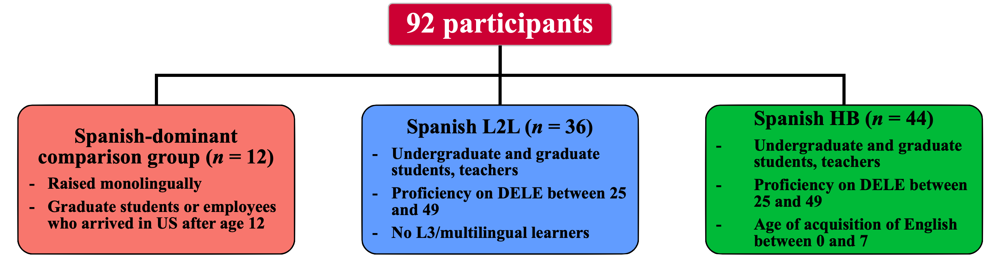
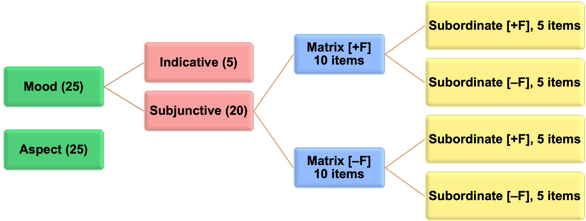

```{r setup, echo = FALSE, include = FALSE, warning = FALSE}
knitr::opts_chunk$set(echo = FALSE, message = FALSE, warning = FALSE)
options(scipen = 999)

library(tidyverse)
library(base)
library(lme4)
library(knitr)
library(kableExtra)
library(ds4ling)
library(xaringan)
library(patchwork)
library(jtools)
library(sjPlot)
library(sjlabelled)
library(sjmisc)
```

```{r, prepare-datasets}
L2_EPT <- read_csv("../CSV Files/L2 Learners/L2 Learners EPT Subjunctive Data.csv")
L2_FCT <- read_csv("../CSV Files/L2 Learners/L2 Learners FCT Subjunctive Data.csv")
L2_Aggregate <- read_csv("../CSV Files/L2 Learners/L2 Learners Aggregate Subjunctive Data.csv")
Heritage_EPT <- read_csv("../CSV Files/Heritage/Heritage EPT Subjunctive Data.csv")
Heritage_FCT <- read_csv("../CSV Files/Heritage/Heritage FCT Subjunctive Data.csv")
Heritage_Aggregate <- read_csv("../CSV Files/Heritage/Heritage Aggregate Subjunctive Data.csv")
Comparison_EPT <- read.csv("../CSV Files/Comparison/Comparison EPT Subjunctive Data.csv")
Comparison_FCT <- read.csv("../CSV Files/Comparison/Comparison FCT Subjunctive Data.csv")
Comparison_Aggregate <- read.csv("../CSV Files/Comparison/Comparison Aggregate Subjunctive Data.csv")

Subjunctive_EPT <- rbind(L2_EPT, Heritage_EPT, Comparison_EPT)
Subjunctive_FCT <- rbind(L2_FCT, Heritage_FCT, Comparison_FCT)
Subjunctive_Aggregate <- rbind(L2_Aggregate, Heritage_Aggregate, Comparison_Aggregate)

Heritage_EPT_Standardized <- aggregate(Heritage_EPT$Response, list(Heritage_EPT$Participant_ID), FUN = mean)
Heritage_EPT_Standardized <- Heritage_EPT_Standardized %>% rename(Part_Avg = x)
Heritage_EPT_Standardized <- left_join(Heritage_EPT, Heritage_EPT_Standardized, by = c("Participant_ID" = "Group.1"))

Heritage_FCT_Standardized <- aggregate(Heritage_FCT$Response, list(Heritage_FCT$Participant_ID), FUN = mean)
Heritage_FCT_Standardized <- Heritage_FCT_Standardized %>% rename(Part_Avg = x)
Heritage_FCT_Standardized <- left_join(Heritage_FCT, Heritage_FCT_Standardized, by = c("Participant_ID" = "Group.1"))

L2_EPT_Standardized <- aggregate(L2_EPT$Response, list(L2_EPT$Participant_ID), FUN = mean)
L2_EPT_Standardized <- L2_EPT_Standardized %>% rename(Part_Avg = x)
L2_EPT_Standardized <- left_join(L2_EPT, L2_EPT_Standardized, by = c("Participant_ID" = "Group.1"))

L2_FCT_Standardized <- aggregate(L2_FCT$Response, list(L2_FCT$Participant_ID), FUN = mean)
L2_FCT_Standardized <- L2_FCT_Standardized %>% rename(Part_Avg = x)
L2_FCT_Standardized <- left_join(L2_FCT, L2_FCT_Standardized, by = c("Participant_ID" = "Group.1"))

Subjunctive_EPT_Aggregate <- aggregate(Subjunctive_EPT$Response, list(Subjunctive_EPT$Participant_ID), FUN = mean)
Subjunctive_EPT_Aggregate <- Subjunctive_EPT_Aggregate %>% rename(Part_Avg = x)
Subjunctive_EPT_Aggregate <- left_join(Subjunctive_EPT, Subjunctive_EPT_Aggregate, by = c("Participant_ID" = "Group.1"))

Subjunctive_FCT_Aggregate <- aggregate(Subjunctive_FCT$Response, list(Subjunctive_FCT$Participant_ID), FUN = mean)
Subjunctive_FCT_Aggregate <- Subjunctive_FCT_Aggregate %>% rename(Part_Avg = x)
Subjunctive_FCT_Aggregate <- left_join(Subjunctive_FCT, Subjunctive_FCT_Aggregate, by = c("Participant_ID" = "Group.1"))
```

```{r, generate-participant-data}
Heritage_Participant_Data = read_csv("../CSV Files/Heritage/Heritage EPT Preterit Data.csv")
L2_Participant_Data = read_csv("../CSV Files/L2 Learners/L2 Learners EPT Preterit Data.csv")
Comparison_Participant_Data = read_csv("../CSV Files/Comparison/Comparison EPT Preterit Data.csv")

Participant_Data = rbind(Heritage_Participant_Data, L2_Participant_Data, Comparison_Participant_Data)
Participant_Data_Singular_Item = Participant_Data %>% 
  filter(Seq_Item == "2")
```

# Introduction

- Central questions in heritage language morphosyntax:


--
  + How do HB differ from monolinguals?

--
  + Do HB and L2L show similarities in acquisition?


--
- Polinsky & Scontras (2020): .RUred[Triggers for deviation] in heritage languages

--
  + **Distance Problem:** Long-distance dependencies are prone to loss

--
  + **Morphology Problem:** Infrequent morphological structures are prone to loss (especially when irregular) 


--
- **Feature reassembly** and **lexical frequency** are complementary frameworks for evaluating these claims and evaluating the source of differences in bilingual grammars

---
# Feature Reassembly

- **Feature Reassembly Hypothesis** (e.g., Lardiere, 2009): L2L reconfigure functional features and map them onto lexical items based upon distributions in the input


--
  + Predictably most difficult where L1/L2 contrasts exist
  + .RUred[Increase] in proficiency ~ increase in appropriate mapping of forms onto lexical items


--
* **Activation Hypothesis** (Putnam & Sánchez, 2013; Putnam et al., 2019): HB reconfigure functional features due to changes in language use


--
  + Staged restructuring of morphosyntax and applicability to lexical items
  + Production affected before comprehension (Perez-Cortes et al., 2019)
  + .RUred[Decrease] in language use ~ decrease in mapping of forms onto lexical items


---
# Lexical Frequency

- **Token frequency**: "how often a particular form appears in the input" (Ellis, 2013, p. 93)


--
- Can indicate gradient processes of reassembly


--
  + Staged model of AH: high-frequency items less affected prior to low-frequency items


--
  + Interaction between frequency of use and token frequency not yet explored in HB research


--
- Positive correlations between token frequency and Spanish HBs' use of inflectional morphology:


--
  + Adjective frequency ~ Gender agreement in DPs (Hur et al., 2020)
  + Subordinate verb frequency ~ subjunctive (Giancaspro, 2020)
  + Matrix verb frequency ~ subjunctive (Perez-Cortez, 2020)
  + Verb ~ differential object marking (Hur, 2021)
  + Verb ~ imperative commands (López-Otero, 2020)


--
- There is tentative evidence that Spanish L2L are also sensitive to lexical effects at intermediate levels:


--
  + Hur (2021): verb ~ differential object marking
  + Gudmestad (2014): matrix governor ~ subjunctive

---
# Subjunctive Mood in Spanish

- Bundles of morphological inflections for either indicative or subjunctive (along with tense/aspect)


--
- Occurs in subordinate clauses with a subject shift and is lexically-conditioned (e.g., Gudmestad, 2014; Kempchinsky, 2009)


--
- Implies desire, obligation, preference, doubt, uncertainty, emotion, or speaker's affect


--
- Matrix governors select the subjunctive (some verbs, some adverbs, some complementizers)
  +  Some of these items are obligatory governors
  +  Some of these items can accept either mood (depends upon truth proposition)


--
- In the present study, I concentrate on .RUred[obligatory contexts] with a .RUred[deontic] (volitional) context


---
# Lexical Selection and Triggers for Deviation

```{r, lexical-selection, show-omnibus-plot, height = 10, fig.width = 16, fig.align = 'center', fig.retina = 2}

```


--
* Lexical effects for the matrix verb: **Distance Problem**


--
  + For HB: Syntactic restructuring of lexical selection
  + For L2L: Mapping of lexical selection onto lower-frequency matrix items
  

--
* Lexical effects for the subordinate verb: **Morphology Problem**


--
  + Difficulties in mapping morphological structure onto appropriate lexical items
  + Less morphological productivity with infrequent subordinate verbs

---
# Participants

```{r, participant-diagram, show-omnibus-plot, height = 10, fig.width = 16, fig.align = 'center', fig.retina = 2}

```

---
# Research Questions

1. **Are there observable differences in quantity of use of subjunctive in obligatory contexts for HB and L2L between a production task and a receptive measure?**


--
HB and L2L will select the subjunctive in an interpretation task more than they will produce it


--
2. **Do frequency of use of and proficiency in Spanish affect HB and L2L in the use of subjunctive morphology in obligatory contexts?**


--
Proficiency and frequency of use will affect HB, proficiency only will affect L2L


--
3. **Does the token frequency of the matrix or subordinate verb affect Spanish HBs’ and L2Ls’ production and selection of subjunctive mood in obligatory contexts?**


--
  + .RUred[(A)	Do HB who report lower quantities of use of or who are less proficient in Spanish show greater susceptibility to these frequency effects?]
  + .RUred[(B) Do less-proficient L2L show greater susceptibility to these frequency effects?]


--
For HB, there will be an effect for the token frequency of the subordinate verb; susceptibility to the token frequency of the matrix verb at lower levels of use


--
For L2L, there will be an effect for the matrix verb at lower proficiency levels


---
# Tasks and Procedure

- Language questionnaire

   + Biographical information
   + 50-point self-reported frequency of use (sum of 10 5-level Likert scales)
   + 9-point lexical frequency scale for each item


--
- 50-item written DELE proficiency measure (Monturl & Slabakova, 2003)


--
- 50-item Elicited Mood Production Task


--
- 50-item Mood Selection Preference Task

---
# Experimental Tasks

- Both tasks contained a similar 50-item structure

--
  + 20 mood items with 4 conditions of 5 items
  + 5 indicative fillers
  + 25 aspect distractors
  

--
- Token frequencies from Davies (2006) *Corpus del español* and participants' self-reported ratings


--
- 2 x 2 design based upon frequency of lexical items (±frequent matrix and ±frequent subordinate verbs)


--
  + 10 volitional matrix verbs


--
  + 10 regular 2-syllable /ar/ subordinate verbs


--
- **Elicited Mood Production Task (EMPT)**: oral/written prompts and a sentence fragment ending with comp. *que* and a bracketed infinitive for participants to complete the sentence


--
- **Mood Preference Selection Task (MPST)**: oral/written prompts and forced choice between "minimal pairs" containing indicative or subjunctive in the subordinate clause


---
# Task Structure

```{r, task_structure, show-omnibus-plot, height = 10, fig.width = 16, fig.align = 'center', fig.retina = 2}

```

---
# Lexical Items

```{r, load-verb-list}
Verbs_List <- read.csv("../CSV Files/Lexical Item Analysis/List of Subjunctive Verbs.csv")
```

```{r, verb-kable}
kable(Verbs_List[1:4], col.names = c("Matrix Verb", "Matrix Lemma", "Subordinate Verb", "Subordinate Lemma"))
```


--
  + Items containing *valorar* and *conseguir* were excluded (not volitional verbs)

---
# Use of Subjunctive by Matrix Verb
```{r, matrix-verb-plot}
Subjunctive_by_Matrix_Verb <- Subjunctive_Aggregate %>%
  ggplot(aes(x = MainVerb, y = Response, color = ExpGroup, shape = Task)) + 
  geom_hline(yintercept = 0.8, color = "white", size = 2) +
  stat_summary(fun.data = mean_se,
               geom = "pointrange", size = 1, 
               position = position_dodge(width = 0.5)) + 
  scale_color_brewer(palette = "Set1", name = "") +
  scale_y_continuous(breaks = seq (0, 1, 0.2),
                     limits = c(0, 1)) +
  scale_x_discrete(labels = c("esperar", "querer", "permitir", "necesitar", "pedir", "desear", "sugerir", "ordenar")) +
  labs(x = "Matrix verb (from highest to lowest frequency)", y = "Proportion of subjunctive responses", color = "Group",
       title = "Average Use of Subjunctive by Matrix Item") +
    theme(axis.text = element_text(size = 16),
        axis.title = element_text(size = 18, face = "bold"),
        plot.title = element_text(hjust = 0.5, size = 24, face = "bold"))
```

```{r, print-matrix-graph, show-omnibus-plot, height = 10, fig.width = 16, fig.align = 'center', fig.retina = 2}
(Subjunctive_by_Matrix_Verb)
```

---
# Use of Subjunctive by Subordinate Verb
```{r, sub-verb-plot}
Subjunctive_by_Subordinate_Verb <- Subjunctive_Aggregate %>%
  ggplot(aes(x = SubVerb, y = Response, color = ExpGroup, shape = Task)) + 
  geom_hline(yintercept = 0.8, color = "white", size = 2) +
  stat_summary(fun.data = mean_se,
               geom = "pointrange", size = 1, 
               position = position_dodge(width = 0.5)) + 
  scale_color_brewer(palette = "Set1", name = "") +
  scale_y_continuous(breaks = seq (0, 1, 0.2),
                     limits = c(0, 1)) +
  scale_x_discrete(labels = c("quedar", "enviar", "dejar", "tratar", "tomar", "viajar", "prestar", "bailar", "robar", "atar")) +
  labs(x = "Subordinate verb (from highest to lowest frequency)", y = "Proportion of subjunctive responses", color = "Group", title = "Subjunctive by Subordinate Verb") +
    theme(axis.text = element_text(size = 16),
        axis.title = element_text(size = 18, face = "bold"),
        plot.title = element_text(hjust = 0.5, size = 24, face = "bold"))
```

```{r, print-sub-graph, show-omnibus-plot, height = 10, fig.width = 16, fig.align = 'center', fig.retina = 2}
(Subjunctive_by_Subordinate_Verb)
```

---
# Heritage Bilinguals, Omnibus Model
```{r, prepare-heritage-omnibus}
HS_Omnibus = glmer(
  Response ~ Task + DELE_Std + FofA_Std + Token_Sub_Std + Token_Main_Std + DELE_Std:Token_Sub_Std + DELE_Std:Token_Main_Std + FofA_Std:Token_Sub_Std + FofA_Std:Token_Main_Std +
    (1 | Participant_ID) + (1 | Item),
  data = Heritage_Aggregate, family = "binomial",
  control = glmerControl(optimizer = "bobyqa", optCtrl = list(maxfun=3e5)))
```

```{r, plot-HS-omnibus}
HS_Omnibus_Plot <- plot_model(HS_Omnibus, show.values = TRUE, value.offset = .3, transform = NULL, vline.color = "black") +
  scale_x_discrete(labels = c("Use : Matrix", "Use : Subordinate", "Proficiency : Matrix", "Proficiency : Subordinate", "Subordinate Verb Frequency", "Matrix Verb Frequency", "Frequency of use", "Proficiency", "Task")) +
  scale_y_continuous(breaks = seq (-2.5, 2.5, 1.25),
                     limits = c(-2.5, 2.5)) +
  labs(title = "Omnibus Model, Heritage Bilinguals", y = "β Estimates") +
  theme(axis.text = element_text(size = 16),
        axis.title = element_text(size = 18, face = "bold"),
        plot.title = element_text(hjust = 0.5, size = 24, face = "bold"))
```

```{r, show-HS-omnibus-plot, height = 10, fig.width = 16, fig.align = 'center', fig.retina = 2}
(HS_Omnibus_Plot)
```

---
# L2 Learners, Omnibus Model
```{r, prepare-L2-omnibus}
L2_Omnibus = glmer(
  Response ~ Task + DELE_Std + FofA_Std + Token_Sub_Std + Token_Main_Std + DELE_Std:Token_Sub_Std + DELE_Std:Token_Main_Std + FofA_Std:Token_Sub_Std + FofA_Std:Token_Main_Std +
    (1 | Participant_ID) + (1 | Item),
  data = L2_Aggregate, family = "binomial",
  control = glmerControl(optimizer = "bobyqa", optCtrl = list(maxfun=3e5)))
```

```{r, plot-L2-omnibus}
L2_Omnibus_Plot <- plot_model(L2_Omnibus, show.values = TRUE, value.offset = .3, transform = NULL, vline.color = "black") +
  scale_x_discrete(labels = c("Use : Matrix", "Use : Subordinate", "Proficiency : Matrix", "Proficiency : Subordinate", "Subordinate Verb Frequency", "Matrix Verb Frequency", "Frequency of use", "Proficiency", "Task")) +
  scale_y_continuous(breaks = seq (-2.5, 2.5, 1.25),
                     limits = c(-2.5, 2.5)) +
  labs(title = "Omnibus Model, L2 Learners", y = "β Estimates") +
  theme(axis.text = element_text(size = 16),
        axis.title = element_text(size = 18, face = "bold"),
        plot.title = element_text(hjust = 0.5, size = 24, face = "bold"))
```

```{r, show-L2-omnibus-plot, height = 10, fig.width = 16, fig.align = 'center', fig.retina = 2}
(L2_Omnibus_Plot)
```

---
# References

Cuza, A. & Pérez-Tattam, S. (2016). Grammatical gender selection and phrasal word order in child heritage Spanish: A feature re-assembly approach. *Bilingualism: Language and Cognition*, *19*(1), 50-68.

Davies, M. (2006). *A frequency dictionary of Spanish: Core vocabulary for learners.* New York, NY: Routledge.

Ellis, N. (2013). Frequency-based grammar and the acquisition of tense and aspect in L2 learning. In M. R. Salaberry & L. Comajoan (Eds.), *Research design and methodology in studies on L2 tense and aspect* (pp. 89-117). Berlin: de Gruyter.

Giancaspro, D. (2020). Not in the mood: Frequency effects in heritage speakers’ subjunctive knowledge. In B. Brehmer, J. Treffers-Daller & D. Berndt (Eds.), *Lost in transmission* (pp. 71-97). Amsterdam: John Benjamins.

Gudmestad, A. (2014). On the role of lexical items in the second-language development of mood use in Spanish. In R. T. Miller, K. I. Martin, C. M. Eddington, A. Henery, N. M. Miguel, A. M. Tseng, A. Tuninetti, and D. Walter (Eds.), *Selected proceedings of the 2012 Second Language Research Forum* (pp. 120-133). Somerville, MA: Cascadilla Proceedings Project.

Hur, K. W. (2021). *Verbal lexical frequency and DOM in heritage speakers of Spanish: The acquisition of differential object marking.* [Unpublished doctoral dissertation]. Rutgers, The State University of New Jersey.

Hur, E., López-Otero, J. C. & Sánchez, L. (2020). Gender agreement and assignment in Spanish heritage speakers: Does frequency matter? *Languages*, *5*(48). https://doi.org/10.3390/languages5040048.

---
# References

Isabelli, C. (2007). Development of the Spanish subjunctive by advanced learners: Study abroad followed by at-home instruction. *Foreign Language Annals*, *40*(2), 330-341.

Iverson, M., Kempchinsky, P. & Rothman, J. (2008). Interface vulnerability and knowledge of the subjunctive/indicative distinction with negated epistemic predicates. *EUROSLA Yearbook*, *8*, 135-163.

Kempchinsky, P. (2009). What can the subjunctive disjoint reference effect tell us about the subjunctive? *Lingua*, *119*, 1788-1810.

Lardiere, D. (2009). Some thoughts on the contrastive analysis of features in second language acquisition. *Second Language Research*, *25*, 173-227.

López-Otero, J. C. (2020). *The acquisition of the syntactic and morphological properties of Spanish imperatives in heritage and second language speakers.* [Unpublished doctoral dissertation]. Rutgers, The State University of New Jersey.

Merino, B. (1983). Language loss in bilingual Chicano children. *Journal of Applied Developmental Psychology*, *4*, 277-294.

Mikulski, A. M. (2010). Age of onset of bilingualism, language use, and the volitional subjunctive in heritage learners of Spanish. *Heritage Language Journal*, *7*(1), 28-46.


---
# References

Montrul, S. (2007). Interpreting mood distinctions in Spanish as a heritage language. In K. Potowski & R. Cameron (Eds.), *Spanish in contact: Policy, social and linguistic inquiries* (pp. 23-40). Amsterdam: John Benjamins.

Montrul, S. (2009). Knowledge of tense-aspect and mood in Spanish heritage speakers. *International Journal of Bilingualism*, *13*(2), 239-269.

Montrul, S. & Slabakova, R. (2003). Competence similarities between native and near-native speakers. *Studies in Second Language Acquisition*, *25*(3), 351-398.

Perez-Cortes, S. (2016). *Acquiring obligatory and variable mood selection: Spanish heritage speakers and L2 learners’ performance in desideratives and reported speech contexts.* [Unpublished doctoral dissertation]. Rutgers, The State University of New Jersey.

Perez-Cortes, S. (2020). Lexical frequency and morphological regularity as sources of heritage speaker variability in the acquisition of mood. *Second Language Research*. https://doi.org/10.1177/0267658320918620.

Perez-Cortes, S., Putnam, M. & Sánchez, L. (2019). Differential access: Asymmetries in accessing features and building representations in heritage language grammars. *Languages*, *4*(81), 1-27.

Polinsky, M. & Scontras, G. (2020). Understanding heritage languages. Bilingualism: Language and Cognition, 23, 4-20. https://doi.org/10.1017/S1366728919000245.


---
# References

Putnam, M., Perez-Cortes, S. & Sánchez, L. (2019). Feature reassembly hypothesis in language attrition contexts. In M. Schmid & B. Kopke (Eds.), *Oxford handbook of language attrition* (pp. 18-24). Oxford: Oxford University Press.

Putnam, M. & Sánchez, L. (2013). What’s so incomplete about incomplete acquisition? A prolegomenon to modeling heritage language grammars. *Linguistic Approaches to Bilingualism*, *3*(4), 478-508.

---
# Appendix A: Participant Proficiency Distribution
```{r, generate-proficiency-histogram}
Proficiency_Histogram <- Participant_Data_Singular_Item %>% 
  ggplot(aes(x = DELE, fill = ExpGroup)) +
  geom_bar(position = "dodge", color = "black") +
  scale_x_continuous(breaks = seq (25, 50, 1),
                     limits = c(24, 51)) +
  scale_y_continuous(breaks = seq(0, 6, 2),
                     limits = c(0, 6)) +
  scale_fill_manual(values = c("#F8766D", "#619CFF", "#00BA38")) +
  labs(x = "DELE Proficiency Score", y = "Number of participants within range", title = "Participants by Group and Proficiency Score", fill = "Group") +
      theme(axis.text = element_text(size = 16),
        axis.title = element_text(size = 18, face = "bold"),
        plot.title = element_text(hjust = 0.5, size = 24, face = "bold"))
```

```{r, print-proficiency-histogram, height = 10, fig.width = 16, fig.align = 'center', fig.retina = 2}
(Proficiency_Histogram)
```

---
# Appendix B: Performance and Proficiency
```{r, generate-subjunctive-proficiency-graphs}
Proficiency_EPT <- Subjunctive_EPT_Aggregate %>%
  ggplot(aes(x = DELE, y = Part_Avg, color = ExpGroup)) + 
  geom_point() +
  geom_smooth(method = lm) +
  scale_color_manual(values = c("#F8766D", "#619CFF", "#00BA38")) +
    scale_y_continuous(breaks = seq (0, 1, 0.2)) +
  labs(x = "Correct responses on DELE proficiency measure", y = "Proportion of subjunctive responses", title = "Subjunctive by Proficiency, EMPT", color = "Group") +
  theme(plot.title = element_text(hjust = 0.5)) +
      theme(axis.text = element_text(size = 16),
        axis.title = element_text(size = 18, face = "bold"),
        plot.title = element_text(hjust = 0.5, size = 24, face = "bold"))

Proficiency_FCT <- Subjunctive_FCT_Aggregate %>%
  ggplot(aes(x = DELE, y = Part_Avg, color = ExpGroup)) + 
  geom_point() +
  geom_smooth(method = lm) +
  scale_color_manual(values = c("#F8766D", "#619CFF", "#00BA38")) +
    scale_y_continuous(breaks = seq (0, 1, 0.2)) +
  labs(x = "Correct responses on DELE proficiency measure", y = "Proportion of subjunctive responses", title = "Subjunctive by Proficiency, MPST", color = "Group") +
  theme(plot.title = element_text(hjust = 0.5)) +
      theme(axis.text = element_text(size = 16),
        axis.title = element_text(size = 18, face = "bold"),
        plot.title = element_text(hjust = 0.5, size = 24, face = "bold"))
```

```{r, show-proficiency-graphs, print-subj-graph, show-omnibus-plot, height = 10, fig.width = 16, fig.align = 'center', fig.retina = 2}
(Proficiency_EPT) + (Proficiency_FCT)
```


---
# Appendix C: Frequency of Use
```{r, generate-use-graphs}
EPT_Use <- Subjunctive_EPT_Aggregate %>%
  ggplot(aes(x = FofA, y = Part_Avg, color = ExpGroup)) + 
  geom_point() +
  geom_smooth(method = lm) +
  scale_color_manual(values = c("#F8766D", "#619CFF", "#00BA38")) +
    scale_y_continuous(breaks = seq (0, 1, 0.2)) +
  labs(x = "Self-reported frequency of use of Spanish", y = "Proportion of subjunctive responses", title = "Subjunctive by Frequency of use, EMPT", color = "Group") +
  theme(plot.title = element_text(hjust = 0.5)) +
      theme(axis.text = element_text(size = 16),
        axis.title = element_text(size = 18, face = "bold"),
        plot.title = element_text(hjust = 0.5, size = 24, face = "bold"))

FCT_Use <- Subjunctive_FCT_Aggregate %>%
  ggplot(aes(x = FofA, y = Part_Avg, color = ExpGroup)) + 
  geom_point() +
  geom_smooth(method = lm) +
  scale_color_manual(values = c("#F8766D", "#619CFF", "#00BA38")) +
    scale_y_continuous(breaks = seq (0, 1, 0.2)) +
  labs(x = "Self-reported frequency of use of Spanish", y = "Proportion of subjunctive responses", title = "Subjunctive by Frequency of use, MPST", color = "Group") +
  theme(plot.title = element_text(hjust = 0.5)) +
      theme(axis.text = element_text(size = 16),
        axis.title = element_text(size = 18, face = "bold"),
        plot.title = element_text(hjust = 0.5, size = 24, face = "bold"))
```

```{r, show-use-graphs, height = 10, fig.width = 16, fig.align = 'center', fig.retina = 2}
(EPT_Use) + (FCT_Use)
```

---
# Appendix D: Correlation between Ratings and Lemma Frequencies
```{r, create-LI-correlation}
Lexical_Item_Report = read.csv("../CSV Files/Lexical Item Analysis/Subjunctive Lexical Item Correlation.csv")

Lexical_Item_Report <- Lexical_Item_Report %>% 
  mutate(Mean_Frequency_Std = (Mean_Frequency - mean(Mean_Frequency))/sd(Mean_Frequency),
         Lemma_Std = (Lemma - mean(Lemma))/sd(Lemma))
```

```{r, create-Davies-corr-plot}
Lexical_Item_Plot <- Lexical_Item_Report %>% 
  ggplot(., aes(x = Mean_Frequency, y = log(Lemma))) + 
  geom_point() + 
  geom_smooth(method = lm) +
  labs(x = "Average participant self-rating", y = "Log-transformed lemma frequency", title = "Correlation of HS Lexical Use and Davies (2006) Lemma Frequency") +
  theme(plot.title = element_text(hjust = 0.5)) +
      theme(axis.text = element_text(size = 16),
        axis.title = element_text(size = 18, face = "bold"),
        plot.title = element_text(hjust = 0.5, size = 24, face = "bold"))
```

```{r, print-Davies-corr-plot, height = 10, fig.width = 16, fig.align = 'center', fig.retina = 2}
(Lexical_Item_Plot)
```